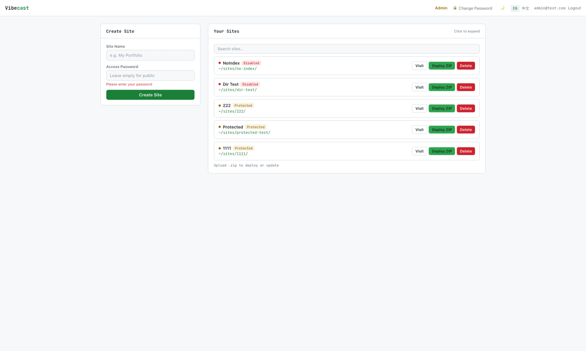
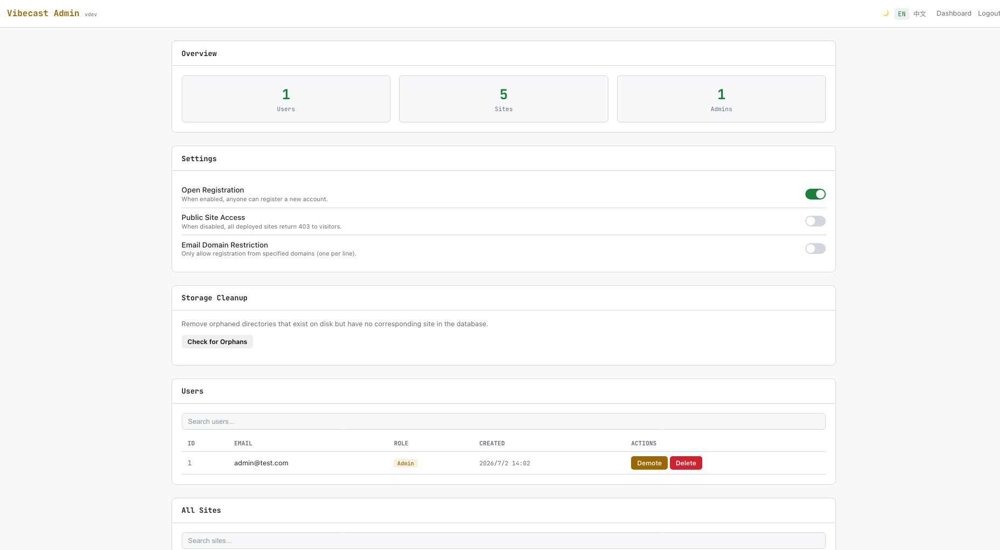

# Vibecast

> Build with vibe. Cast instantly.

A self-hosted, multi-user static site hosting platform built in pure Go.
No Nginx, no external web server — one binary handles everything: authentication, site management, deployment, and static file serving.



---

[中文说明](#vibecast-中文说明)

---

## Features

### Deployment

- **ZIP Deploy** — Upload a ZIP, auto-extract and deploy instantly
- **Single File Upload** — Upload individual files without creating a ZIP
- **Smart Extraction** — Strips junk paths (`__MACOSX`, `.git`, `.DS_Store`, `node_modules`, dotfiles)
- **File Type Filtering** — Blocks dangerous extensions (`.exe`, `.sh`, `.cgi`, `.php`, etc.)
- **Configurable Upload Limit** — Admin-adjustable max upload size (default 50 MB)
- **Per-User Site Limit** — Cap how many sites each user can create (default 30)

### Management

- **Admin Panel** — User management, site oversight, storage cleanup, system settings
- **Visit Stats** — Per-site daily / monthly / total visit counts
- **One-Click Share** — Generate share text with site URL and password, copy to clipboard
- **Password Protection** — Optional per-site password gate (7-day session cookie)
- **Password Toggle** — Show/hide toggle on all password inputs
- **Random Slugs** — Auto-generated unguessable URLs, no need to pick a slug
- **Directory Listing** — nginx-style auto-index when no `index.html` exists
- **File Tree** — Click any site to expand and browse its files

### System

- **In-App Self-Update** — Check for new versions and update directly from the admin panel
- **CLI Update** — `vibecast -update` to upgrade from the command line
- **GitHub Mirror Support** — Auto-fallback to China mirrors for downloads behind GFW
- **Version Info** — `vibecast -v` or `-version` prints the version; admin panel shows it in the navbar
- **Reverse-Proxy Ready** — All URLs are relative, works behind any sub-path without config
- **Zero External Dependencies** — Pure Go + SQLite, no CGO, no Nginx, no Node.js

### UI / UX

- **Dark / Light Theme** — Toggle with CSS variables, persisted per user
- **Mobile Optimized** — Responsive admin layout with bottom nav bar, horizontal table scroll
- **Bilingual EN / 中文** — Full i18n across UI and API error messages
- **SVG Captcha** — Math captcha rendered as SVG with noise and rotation
- **Custom Dialogs** — No ugly browser `confirm()` / `alert()` — all dialogs are custom-built
- **V Logo** — Favicon and navbar icon across all pages

## Screenshots

### Dashboard

Manage your sites — create, deploy, view file tree, toggle password, copy URL, share.


### Admin Panel

Full administrative control — stats, settings, user management, site oversight, cleanup, self-update.



## Installation

### One-liner (Linux / macOS)

```bash
curl -fsSL https://raw.githubusercontent.com/vst93/Vibecast/main/install.sh | bash
```

Or with wget:

```bash
wget -qO- https://raw.githubusercontent.com/vst93/Vibecast/main/install.sh | bash
```

Options:

```bash
# Install a specific version
curl -fsSL https://raw.githubusercontent.com/vst93/Vibecast/main/install.sh | bash -s -- --version 20260703-14

# Install to a custom directory
curl -fsSL https://raw.githubusercontent.com/vst93/Vibecast/main/install.sh | bash -s -- --dir /opt/vibecast
```

The script auto-detects your OS and architecture (linux/darwin, amd64/arm64), downloads the matching binary from [Releases](../../releases), and installs it to `/usr/local/bin/vibecast`. GitHub mirror proxies are tried automatically for users in China.

### Build from source

```bash
git clone https://github.com/vst93/Vibecast.git
cd Vibecast
make build
./bin/vibecast
```

### Manual download

Grab the binary for your platform from the [Releases](../../releases) page, make it executable, and run.

## Quick Start

```bash
vibecast

# or with custom config
vibecast -addr :3000 -storage ./data/sites -db ./data/vibecast.db
```

Open `http://localhost:8080/dashboard` — the first registered user becomes admin.

## Usage

1. **Register** at `/dashboard` — first user is auto-promoted to admin
2. **Create a site** — just give it a name; a random slug is generated for you
3. **Deploy** — upload a ZIP or a single file
4. **Visit** — your site goes live at `/s/{slug}/`
5. **Share** — click the share button to copy a ready-to-paste message with URL and password
6. **Manage** — expand any site to view its file tree and visit stats; admin panel at `/admin`

Admins can toggle open registration, disable public access, restrict email domains, configure upload size and site limits, clean up orphaned directories, check for updates, and manage all users and sites from `/admin`.

## Updating

```bash
# Check and update from the command line
vibecast -update

# Or update from the admin panel → System → Check for Updates
```

The update system fetches the latest release from GitHub, verifies the asset matches your OS/arch, downloads via mirror proxies if needed, and replaces the running binary.

## Configuration

| Flag | Env Var | Default | Description |
|------|---------|---------|-------------|
| `-addr` | `VIBECAST_ADDR` | `:8080` | Listen address |
| `-storage` | `VIBECAST_STORAGE` | `./data/sites` | Site files storage directory |
| `-db` | `VIBECAST_DB` | `./data/vibecast.db` | SQLite database path |

Additional settings (upload size limit, site limit per user, registration, public access, email domain restriction) are configurable at runtime from the admin panel.

## Architecture

```
cmd/server/main.go        — Entry point, CLI flags, graceful shutdown, update CLI
internal/db/              — SQLite schema, migrations, data models, settings, visit stats
internal/auth/            — bcrypt, session tokens, middleware
internal/storage/         — ZIP extraction, single file save, path traversal & file type protection
internal/server/          — HTTP handlers, routing, static serving, captcha, i18n, self-update, all UI
```

## Tech Stack

Go 1.23+ · SQLite (pure Go driver) · bcrypt · vanilla JS SPA · no build step

## License

MIT

---

# Vibecast 中文说明

> 随心构建，即刻发布。

一个自托管的纯 Go 多用户静态站点托管平台。
不依赖 Nginx 或任何外部 Web Server —— 一个二进制搞定一切：认证、站点管理、部署、静态文件服务。


---

## 功能特性

### 部署

- **ZIP 部署** — 上传 ZIP，自动解压即时上线
- **单文件上传** — 无需打包 ZIP，直接上传单个文件
- **智能解压** — 自动剔除垃圾路径（`__MACOSX`、`.git`、`.DS_Store`、`node_modules`、 dotfiles）
- **文件类型过滤** — 拦截危险扩展名（`.exe`、`.sh`、`.cgi`、`.php` 等）
- **可配置上传限制** — 管理员可调整最大上传大小（默认 50 MB）
- **用户站点限额** — 限制每用户可创建站点数（默认 30）

### 管理

- **管理后台** — 用户管理、站点总览、存储清理、系统设置
- **访问统计** — 每站点的今日 / 本月 / 总计访问量
- **一键分享** — 生成包含站点 URL 和密码的分享文本，一键复制
- **密码保护** — 可选的站点级密码门禁（7 天有效 Cookie）
- **密码显隐** — 所有密码输入框支持显示/隐藏切换
- **随机 Slug** — 自动生成不可猜测的 URL，无需手动填写
- **目录列表** — 无 index.html 时自动展示 nginx 风格目录列表
- **文件树** — 点击展开任意站点查看文件列表

### 系统

- **应用内自更新** — 在管理后台直接检查新版本并一键更新
- **命令行更新** — `vibecast -update` 从命令行升级
- **GitHub 镜像加速** — 国内自动回退到镜像代理下载
- **版本信息** — `vibecast -v` 或 `-version` 查看版本号，管理后台导航栏显示版本
- **反向代理友好** — 所有 URL 均为相对路径，支持任意子路径部署，无需配置
- **零外部依赖** — 纯 Go + SQLite，无需 CGO、Nginx、Node.js

### 界面 / 体验

- **深色 / 浅色主题** — CSS 变量切换，用户偏好持久化
- **移动端优化** — 响应式后台布局，底部导航栏，表格横向滚动
- **中英文双语** — UI 和 API 错误提示全面支持
- **SVG 验证码** — 数学验证码，含噪点和旋转干扰
- **自定义弹窗** — 不使用浏览器原生 `confirm()` / `alert()`，全部自实现
- **V 标志** — 全站 favicon 和导航栏图标

## 截图

### Dashboard 管理面板

管理你的站点 — 创建、部署、查看文件树、切换密码、复制链接、分享。


### Admin 管理后台

完整的后台管理 — 统计、设置、用户管理、站点总览、存储清理、在线更新。


## 安装

### 一键安装（Linux / macOS）

```bash
curl -fsSL https://raw.githubusercontent.com/vst93/Vibecast/main/install.sh | bash
```

或使用 wget：

```bash
wget -qO- https://raw.githubusercontent.com/vst93/Vibecast/main/install.sh | bash
```

可选参数：

```bash
# 安装指定版本
curl -fsSL https://raw.githubusercontent.com/vst93/Vibecast/main/install.sh | bash -s -- --version 20260703-14

# 安装到自定义目录
curl -fsSL https://raw.githubusercontent.com/vst93/Vibecast/main/install.sh | bash -s -- --dir /opt/vibecast
```

脚本自动检测操作系统和架构（linux/darwin，amd64/arm64），从 [Releases](../../releases) 下载对应二进制并安装到 `/usr/local/bin/vibecast`。国内用户自动尝试 GitHub 镜像代理。

### 从源码编译

```bash
git clone https://github.com/vst93/Vibecast.git
cd Vibecast
make build
./bin/vibecast
```

### 手动下载

从 [Releases](../../releases) 页面下载对应平台的二进制，赋予执行权限后运行。

## 快速开始

```bash
vibecast

# 或指定配置
vibecast -addr :3000 -storage ./data/sites -db ./data/vibecast.db
```

打开 `http://localhost:8080/dashboard`，首个注册用户自动成为管理员。

## 使用方式

1. **注册** — 在 `/dashboard` 注册，首用户自动成为管理员
2. **创建站点** — 填个名字即可，系统自动生成随机 slug
3. **部署** — 上传 ZIP 压缩包或单个文件
4. **访问** — 站点上线地址为 `/s/{slug}/`
5. **分享** — 点击分享按钮，复制包含 URL 和密码的分享文本
6. **管理** — 点击站点展开查看文件树和访问统计；管理后台在 `/admin`

管理员可在 `/admin` 开关注册、禁用公开访问、限制邮箱域名、配置上传大小和站点限额、清理孤立目录、检查更新，以及管理所有用户和站点。

## 更新

```bash
# 命令行检查并更新
vibecast -update

# 或在管理后台 → 系统 → 检查更新
```

更新系统从 GitHub 获取最新版本，校验资产与当前 OS/架构匹配，通过镜像代理下载（如需），替换正在运行的二进制文件。

## 配置项

| 参数 | 环境变量 | 默认值 | 说明 |
|------|----------|--------|------|
| `-addr` | `VIBECAST_ADDR` | `:8080` | 监听地址 |
| `-storage` | `VIBECAST_STORAGE` | `./data/sites` | 站点文件存储目录 |
| `-db` | `VIBECAST_DB` | `./data/vibecast.db` | SQLite 数据库路径 |

其余设置（上传大小限制、每用户站点限额、注册开关、公开访问、邮箱域名限制）可在管理后台运行时配置。

## 架构

```
cmd/server/main.go        — 入口，CLI 参数，优雅关闭，更新命令行
internal/db/              — SQLite schema、迁移、数据模型、设置、访问统计
internal/auth/            — bcrypt、Session Token、认证中间件
internal/storage/         — ZIP 解压、单文件保存、路径遍历与文件类型防护
internal/server/          — HTTP Handler、路由、静态服务、验证码、i18n、自更新、全部前端页面
```

## 技术栈

Go 1.23+ · SQLite（纯 Go 驱动）· bcrypt · 原生 JS 单页应用 · 无构建步骤

## 开源协议

MIT
