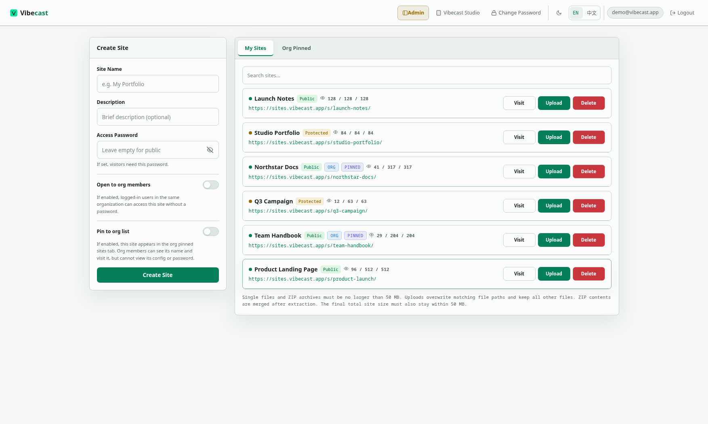

<div align="center">

# Vibecast

**Build with vibe. Cast instantly.**

A lightweight, self-hosted platform for publishing static sites and shareable files.

[](https://go.dev/) [](https://github.com/vst93/Vibecast/releases/latest) [](#license--开源协议)

[English](#english) | [中文](#中文)

</div>



---

<a id="english"></a>

## English

Vibecast packages authentication, site management, deployment, analytics, static file serving, and self-update into one Go binary. It uses SQLite for metadata and the local filesystem for deployed content. No Nginx, Node.js, CGO, or separate database server is required.

### Quick Start

Install the latest release on Linux or macOS:

```bash
curl -fsSL https://raw.githubusercontent.com/vst93/Vibecast/main/install.sh | bash
vibecast
```

Open [http://localhost:8080/dashboard](http://localhost:8080/dashboard). The first registered user automatically becomes an administrator.

To run Vibecast as a system service:

```bash
vibecast setup
```

### What It Does

| Area | Capabilities |
| --- | --- |
| Deploy | Upload ZIP archives or individual HTML, PDF, Office, image, media, and text files |
| Protect | Add per-site passwords, seven-day access sessions, and organization-level access |
| Manage | Browse files, edit site details, copy share links, and clean up deployed content |
| Organize | Create invite-only organizations and pin shared sites for members |
| Observe | Track visits for today, the current month, and all time |
| Operate | Manage users, limits, registration, domains, updates, and storage from the admin panel |

Additional platform features:

- Random, hard-to-guess site slugs
- Safe ZIP extraction with traversal protection and junk-file filtering
- Configurable upload size and per-user site limits
- Dangerous file type blocking
- Light and dark themes with responsive desktop and mobile layouts
- Complete English and Chinese UI, API errors, and CLI output
- HttpOnly session cookies, bcrypt password hashing, same-origin checks, rate limits, and SVG captcha
- SHA256-verified self-update with GitHub mirror fallback
- Reverse proxy and sub-path support

### Workflow

1. Register at `/dashboard`.
2. Create a site and optionally add a password or organization access.
3. Upload a ZIP archive or a single file.
4. Open the generated `/s/{slug}/` URL.
5. Share the URL, or expand the site to inspect files and visit statistics.

Administrators use `/admin` to manage users and sites, configure limits, control registration and public access, restrict email domains, clean orphaned storage, inspect runtime paths, and install updates.

### Installation

#### Install Script

The installer detects Linux/macOS and amd64/arm64, downloads the matching asset, and installs it to `/usr/local/bin/vibecast`.

```bash
# curl
curl -fsSL https://raw.githubusercontent.com/vst93/Vibecast/main/install.sh | bash

# wget
wget -qO- https://raw.githubusercontent.com/vst93/Vibecast/main/install.sh | bash

# specific version
curl -fsSL https://raw.githubusercontent.com/vst93/Vibecast/main/install.sh | bash -s -- --version 20260819-2

# custom install directory
curl -fsSL https://raw.githubusercontent.com/vst93/Vibecast/main/install.sh | bash -s -- --dir /opt/vibecast
```

#### Build From Source

```bash
git clone https://github.com/vst93/Vibecast.git
cd Vibecast
make build
./bin/vibecast
```

Prebuilt binaries for Linux, macOS, and Windows are available from [GitHub Releases](https://github.com/vst93/Vibecast/releases/latest).

### Data Paths

The defaults are stored under the current user's home directory:

| Resource | Default |
| --- | --- |
| Site files | `~/data/sites` |
| SQLite database | `~/data/vibecast.db` |

Relative data paths are also anchored to the current user's home. For example, `./data/vibecast.db` resolves to `~/data/vibecast.db`, regardless of the executable or service working directory. Explicit absolute paths remain unchanged.

`vibecast setup` writes absolute paths into the service definition. This keeps the same database and site storage in use across updates and restarts.

### Service Management

Register or refresh the service definition:

```bash
vibecast setup
```

Linux uses a user-level systemd service:

```bash
systemctl --user status vibecast
systemctl --user stop vibecast
systemctl --user restart vibecast
```

macOS uses a launchd daemon:

```bash
sudo launchctl list | grep vibecast
sudo launchctl stop com.vibecast
sudo launchctl start com.vibecast
```

Remove the service with:

```bash
vibecast uninstall
```

Windows service registration is not built in. Use [NSSM](https://nssm.cc/) or Task Scheduler.

### Updating

Update from the admin panel under **System**, or from the command line:

```bash
vibecast update
```

Vibecast selects the correct OS/architecture asset, downloads it, verifies its SHA256 checksum, and replaces the current binary.

> [!IMPORTANT]
> Existing services installed by a version older than `20260819-2` should perform this one-time migration from a terminal:
>
> ```bash
> vibecast update
> vibecast setup
> ```
>
> This rewrites legacy relative data paths as absolute home-directory paths and restarts the service with the new definition. After this migration, future admin-panel updates can restart automatically without switching databases.

On Windows, the running executable may need to be stopped before replacement.

### CLI Reference

```text
Usage: vibecast [options] [command]

Options:
  --addr <addr>      listen address (default ":8080", env VIBECAST_ADDR)
  --storage <dir>    site files directory (default "~/data/sites", env VIBECAST_STORAGE)
  --db <path>        SQLite database path (default "~/data/vibecast.db", env VIBECAST_DB)

Commands:
  version, v         print version and exit
  update             check for updates and self-update
  setup              register or refresh the system service
  uninstall          remove the system service
  help, h            show help
```

CLI messages automatically use Chinese in UTC+8 and English in other timezones.

### Architecture

```text
cmd/server/main.go        entry point, CLI, HTTP server, graceful restart
internal/auth/            authentication and session helpers
internal/db/              SQLite schema, migrations, models, and settings
internal/storage/         ZIP extraction and file safety
internal/server/          handlers, pages, static serving, updates, services, i18n
```

Tech stack: Go 1.23+, SQLite, vanilla JavaScript, inline HTML/CSS, no frontend build step.

---

<a id="中文"></a>

## 中文

Vibecast 是一个轻量的自托管静态内容发布平台。认证、站点管理、文件部署、访问统计、静态文件服务和在线更新全部集成在一个 Go 二进制中；元数据保存在 SQLite，站点内容保存在本地文件系统。无需 Nginx、Node.js、CGO 或独立数据库服务。

### 快速开始

在 Linux 或 macOS 安装最新版：

```bash
curl -fsSL https://raw.githubusercontent.com/vst93/Vibecast/main/install.sh | bash
vibecast
```

打开 [http://localhost:8080/dashboard](http://localhost:8080/dashboard)。第一个注册用户会自动成为管理员。

注册为系统服务：

```bash
vibecast setup
```

### 主要能力

| 领域 | 功能 |
| --- | --- |
| 部署 | 上传 ZIP，或直接上传 HTML、PDF、Office、图片、音视频和文本文件 |
| 保护 | 站点密码、7 天访问会话，以及组织成员免密码访问 |
| 管理 | 浏览文件、编辑站点、复制分享链接、清理已部署内容 |
| 组织 | 创建邀请码组织，并为成员钉选共享站点 |
| 统计 | 查看站点今日、本月和累计访问量 |
| 运维 | 在管理后台管理用户、限额、注册、域名、更新和存储 |

平台还包括：

- 自动生成难以猜测的随机 Slug
- 防止路径穿越并过滤垃圾文件的安全 ZIP 解压
- 可配置上传大小和每用户站点数
- 危险文件类型拦截
- 深色 / 浅色主题和响应式桌面、移动端布局
- UI、API 错误和 CLI 的完整中英文支持
- HttpOnly Session Cookie、bcrypt 密码哈希、同源校验、限流和 SVG 验证码
- 带 SHA256 校验和 GitHub 镜像回退的自更新
- 反向代理及子路径部署支持

### 使用流程

1. 在 `/dashboard` 注册。
2. 创建站点，可选设置密码或组织访问权限。
3. 上传 ZIP 或单个文件。
4. 通过生成的 `/s/{slug}/` 地址访问站点。
5. 分享链接，或展开站点查看文件与访问统计。

管理员可在 `/admin` 管理用户和站点、配置限额、控制注册和公开访问、限制邮箱域名、清理孤立存储、查看运行路径并安装更新。

### 安装

#### 安装脚本

脚本会识别 Linux/macOS 和 amd64/arm64，下载对应文件并安装到 `/usr/local/bin/vibecast`。

```bash
# curl
curl -fsSL https://raw.githubusercontent.com/vst93/Vibecast/main/install.sh | bash

# wget
wget -qO- https://raw.githubusercontent.com/vst93/Vibecast/main/install.sh | bash

# 指定版本
curl -fsSL https://raw.githubusercontent.com/vst93/Vibecast/main/install.sh | bash -s -- --version 20260819-2

# 自定义安装目录
curl -fsSL https://raw.githubusercontent.com/vst93/Vibecast/main/install.sh | bash -s -- --dir /opt/vibecast
```

#### 从源码编译

```bash
git clone https://github.com/vst93/Vibecast.git
cd Vibecast
make build
./bin/vibecast
```

Linux、macOS 和 Windows 的预编译文件可从 [GitHub Releases](https://github.com/vst93/Vibecast/releases/latest) 下载。

### 数据路径

默认数据保存在当前用户的 home 目录：

| 资源 | 默认路径 |
| --- | --- |
| 站点文件 | `~/data/sites` |
| SQLite 数据库 | `~/data/vibecast.db` |

相对数据路径同样以当前用户的 home 为基准。例如，无论程序或服务的工作目录在哪里，`./data/vibecast.db` 都会解析为 `~/data/vibecast.db`。明确指定的绝对路径保持不变。

`vibecast setup` 会把绝对路径写入服务定义，确保更新和重启始终使用同一份数据库与站点文件。

### 服务管理

注册或刷新服务定义：

```bash
vibecast setup
```

Linux 使用用户级 systemd 服务：

```bash
systemctl --user status vibecast
systemctl --user stop vibecast
systemctl --user restart vibecast
```

macOS 使用 launchd daemon：

```bash
sudo launchctl list | grep vibecast
sudo launchctl stop com.vibecast
sudo launchctl start com.vibecast
```

卸载服务：

```bash
vibecast uninstall
```

Windows 暂不内置服务注册，请使用 [NSSM](https://nssm.cc/) 或任务计划程序。

### 更新

可在管理后台的 **系统** 页面更新，也可使用命令行：

```bash
vibecast update
```

Vibecast 会选择匹配当前操作系统和架构的文件，下载并校验 SHA256，然后替换当前二进制。

> [!IMPORTANT]
> 使用早于 `20260819-2` 版本注册服务的现有安装，应在终端执行一次迁移：
>
> ```bash
> vibecast update
> vibecast setup
> ```
>
> 这会把旧服务中的相对路径重写为 home 下的绝对路径，并按新定义重启服务。完成这次迁移后，后续通过管理后台更新即可自动重启，也不会切换到另一份数据库。

Windows 可能需要先停止正在运行的程序，再替换二进制。

### 命令行参考

```text
用法: vibecast [选项] [命令]

选项:
  --addr <addr>      监听地址（默认 ":8080"，环境变量 VIBECAST_ADDR）
  --storage <dir>    站点文件目录（默认 "~/data/sites"，环境变量 VIBECAST_STORAGE）
  --db <path>        SQLite 数据库路径（默认 "~/data/vibecast.db"，环境变量 VIBECAST_DB）

命令:
  version, v         打印版本号
  update             检查更新并自更新
  setup              注册或刷新系统服务
  uninstall          卸载系统服务
  help, h            显示帮助
```

CLI 会根据时区自动选择语言：UTC+8 输出中文，其他时区输出英文。

### 项目结构

```text
cmd/server/main.go        入口、CLI、HTTP 服务和优雅重启
internal/auth/            认证与 Session 辅助逻辑
internal/db/              SQLite Schema、迁移、模型和设置
internal/storage/         ZIP 解压与文件安全
internal/server/          Handler、页面、静态服务、更新、服务注册和 i18n
```

技术栈：Go 1.23+、SQLite、原生 JavaScript、内联 HTML/CSS，无前端构建步骤。

## License / 开源协议

MIT
